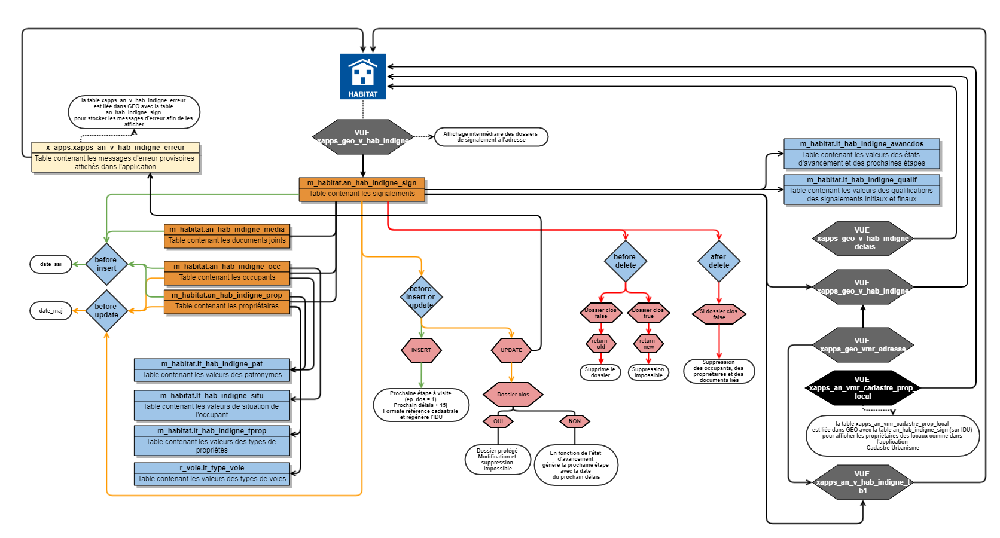

# Documentation d'administration de la base de données sur l'habitat indigne #

## Principes
  * **généralité** :

La base de données développée ici a été conçue pour répondre à une logique de suivi des signalements d'habitat indigne (péril, insalubrité,...). Elle permet au service en charge de cette démarche de mieux suivre les dossiers et d'être plus réactif. De plus, les signalements reposent sur une localisation à l'adresse issue de la Base Adresse Locale de l'Agglomération de la Région de Compiègne. 
 
 * **résumé fonctionnel** :

Pour rappel des grands principes :

* Un signalement doit comporter au moins un nom de dossier, une date de signalement, l'origine du signalement, une qualification.
* L'enregistrement de base d'un signalemeent affecte par défaut une date de demande de visite à la date du signalement et génère un délais de visite à 15 jours
* La mise à jour de l'état d'avancement d'un dossier génère automatiquement la prochaine étape et calcul (si nécessaire ou le demande) une date du prochain délais pour le suivi du dossier.

  - entre un signalement et la visite = +15 jours
  - entre la visite et le rapport de visite = +15 jours
  - entre le rapport de visite et le courrier initial = +5 jours (à partir de la date de réception du rapport qui doit être obligatoirement saisie)
  - entre le courrier initial et la réponse du propriétaire : la date du délais doit-être obligatoirement mise à jour
  - entre la réponse du propriétaire et la relance : la date du délais doit-être obligatoirement mise à jour
  - entre la relance et l'arrêté de mise en demeure : la date du délais doit-être obligatoirement mise à jour
  - entre l'arrêté de mise en demeure et l'annonce fin de travaux : la date du délais doit-être obligatoirement mise à jour
  - entre l'annonce fin de travaux et la visite de fin de travaux : + 15 jours (à partir de la date de fin de travaux qui doit être obligatoirement saisie)
  - entre la visite de fin de travaux et la clôture du dossier : la date du délais doit-être obligatoirement mise à jour

La clôture d'un dossier empêche celui-ci d'être à nouveau ouvert et modifié.

* Le renseignement des références cadastrales permet dans l'onglet Propriétaire d'afficher les informations des locaux et d'accéder à la fiche des locaux de l'application Cadastre-Urbanisme.

## Schéma fonctionnel

## Dépendances

La base de données Habitat Indigne s'appuie sur des référentiels préexistants constituant autant de dépendances nécessaires pour l'implémentation de la base de données.

|schéma | table | description | usage |
|:---|:---|:---|:---|   
|r_voie|lt_type_voie|domaine de valeur générique d'une table géographique|type de voie d'un propriétaire|
|x_apps|xapps_geo_vmr_adresse|donnée de référence des adresses |récupération de la géométrie du point d'adresse et de l'adressage|

---

## Classes d'objets

L'ensemble des classes d'objets unitaires sont stockées dans le schéma m_habitat, celles dérivées et applicatives dans le schéma x_apps, celles dérivées pour les exports opendata dans le schéma x_opendata.

### Classe d'objet géographique et patrimoniale

Sans objet. La géométrie utilisée est celle des points d'adresse. Cette classe est détaillée dans le dossier RVA.

### Classe d'objet signalements

`an_hab_indigne_sign` : table des attributs spécifiques au signalement d'un habitat indigne.

|Nom attribut | Définition | Type  | Valeurs par défaut |
|:---|:---|:---|:---|  
|id_dos|Identifiant unique interne ARC du signalement|integer|nextval('m_habitat.an_hab_indigne_sign_seq'::regclass)|
|id_adresse|Identifiant de l'adresse|integer| |
|nm_doc|Référence du dossier ARC|character varying(254)| |
|n_dos|Numéro de dossier de l'organisme extérieur ayant fait le signalement|character varying(254)| |
|compt_ad|Complément d'adresse|character varying(254)| |
|o_signal|Provenance du signalement|character varying(254)| |
|d_signal|Date du signalement|timestamp without time zone| |
|q_init|Qualification initiale du signalement (liste de valeur dans lt_hab_indigne_qualif)|character varying(2)| |
|q_det|Détail de la qualification initiale|character varying(254)| |
|d_visit_d|Date de demande d'une visite|timestamp without time zone| |
|d_visit_e|Date de la visite|timestamp without time zone| |
|o_visit|Opérateur de la visite|character varying(100)| |
|m_nvisit|Motif de la non visite|character varying(254)| |
|d_rvisit|Date du rapport de la visite|timestamp without time zone| |
|q_final|Qualification finale du signalement (lien vers lt_hab_indigne_qualif)|character varying(2)| |
|r_rvisit|Résumé du rapport de visite|character varying(1000)| |
|action|Action(s) à entreprendre|character varying(1000)| |
|av_dos|Avancement du dossier|character varying(254)| |
|d_pvmed|Date du procès-verbal de mise en demeure|timestamp without time zone| |
|d_pdelais|Date du prochain délai|timestamp without time zone| |
|d_visitconf|Date de la visite de conformité|timestamp without time zone| |
|cloture|Dossier clos|boolean|false|
|m_avise|Information donnée au maire|boolean|false|
|nblog|Nombre de logements|character varying(20)| |
|occupation|Le logement ou l'immeuble concerné est-il occupé ?|boolean|true|
|dos_anah|Dossier ANAH|boolean|false|
|observ|Observations|character varying(2500)| |
|op_sai|Opérateur de saisie de l'information|character varying(80)| |
|date_sai|Date de saisie de l'information|timestamp without time zone| |
|date_maj|Date de mise à jour de l'information|timestamp without time zone| |
|e_dos|Etat d'avancement du dossier (liste de valeur dans lt_hab_indigne_avancdos)|character varying(2)|10|
|ep_dos|Prochaine étape d'avancement du dossier (liste de valeur dans lt_hab_indigne_avancdos)|character varying(2)|20|
|secpar|Section cadastrale de la propriété|character varying(2)| |
|numpar|Numéro de la parcelle de la propriété|integer| |
|d_ftrav|Date de fin de travaux (information du propriétaire)|timestamp without time zone| |
|idu|Clé de référence parcellaire déduie des attributs secpar et numpar saisie par l'utilisateur et regénéré via la trigger. Cette clé permet de faire le lien dans GEO avec latable Parcelle (Alpha) V3 pour accéder à la fiche parcelle depuis la fiche de sig (...)|

* 5 triggers :
  * `t_t1_an_hab_indigne_sign_date_sai` : trigger d'insertion de la date de daisie
  * `t_t2_an_hab_indigne_sign_date_maj` : trigger de mise à jour de la date de mise à jour 
  * `t_t3_an_hab_indigne_avancdos` : trigger gérant la mise à jour des prochaines étapes du dossier, des dates de délais et les messages d'erreurs
  * `t_t4_an_hab_indigne_delete` : trigger gérant la suppression ou non d'un dossier
  * `t_t5_an_hab_indigne_occprop_delete` : trigger gérant la suppression des occupants, propriétaires et les documents liés à un signalement qui peut être supprimé
  
### classes d'objets applicatives métiers sont classés dans le schéma x_apps :
 
`x_apps.xapps_an_v_hab_indigne_tb1` : Vue applicative tableau de bord (tableau 1) décomptant le nombre de dossier par commune par qualification formaté en tableau HTML pour affichage dans l'application Web de gestion

`x_apps.xapps_geo_v_hab_indigne_delais` : Vue applicative sélectionnant les adresses sur lesquelles la date du prochain délais est supérieur à la date du jour (délais dépassé)

`x_apps.xapps_geo_v_hab_indigne` : Vue applicative récupérant le nombre de dossier d'habitat indigne par adresse et affichant l'état du dernier signalement pour affichage la liste des dossiers à la sélection d'une adresse

`x_apps.xapps_an_vmr_cadastre_prop_local` : Vue matérialisée contenant les informations issues du cadastre listant les locaux sur la parcelle avec le propriétaire et son adresse

### classes d'objets applicatives grands publics sont classés dans le schéma x_apps_public :

Sans objet

### classes d'objets opendata sont classés dans le schéma x_opendata :

Sans objet

